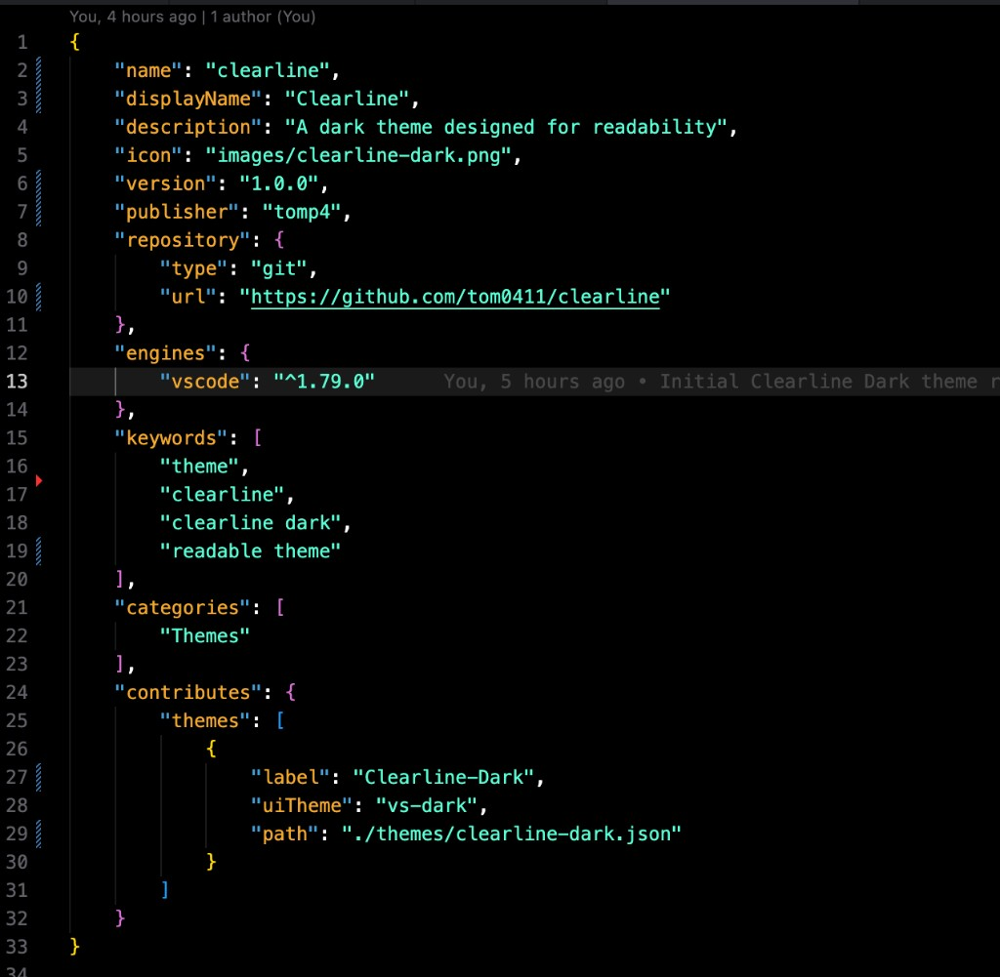
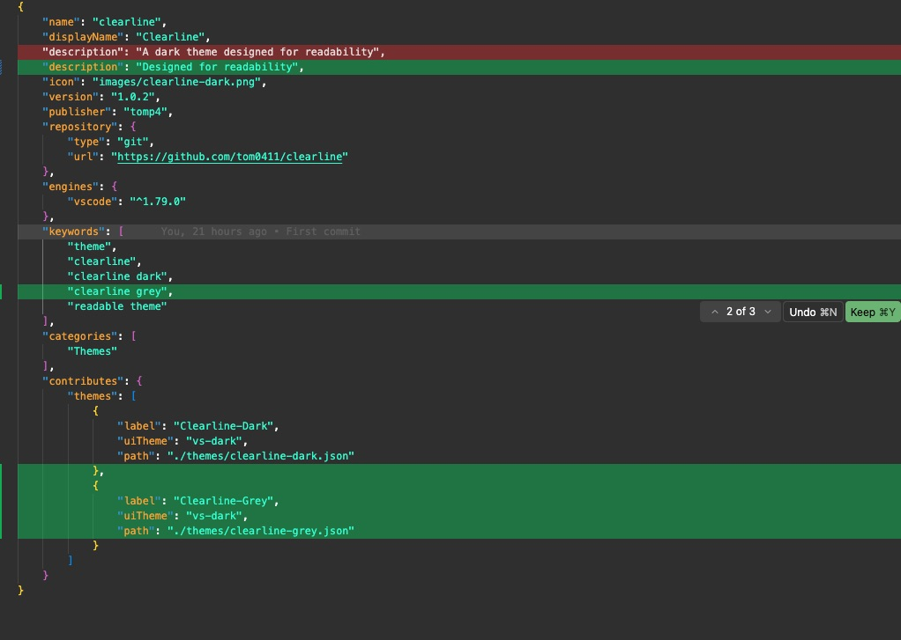

# Clearline

Designed for readability — **Clearline-Dark**, **Clearline-Grey**, and **Clearline-Slate**.

## Preview

### Clearline-Dark

  

### Clearline-Grey

  

| Theme | Editor / sidebar |
|---|---|
| **Clearline-Grey** | `#363636` |
| **Clearline-Slate** | `#303039` |

## Credits

Based on [ChatGP-Theme](https://github.com/0xJariel/ChatGP-Theme) by [0xJariel](https://github.com/0xJariel).

Licensed under [CC BY-NC-SA 4.0](https://creativecommons.org/licenses/by-nc-sa/4.0/). This theme is modified from the original, renamed to **Clearline Dark**, and published by [tom0411](https://github.com/tom0411).

Vibe code with Cursor Grok 4.5
