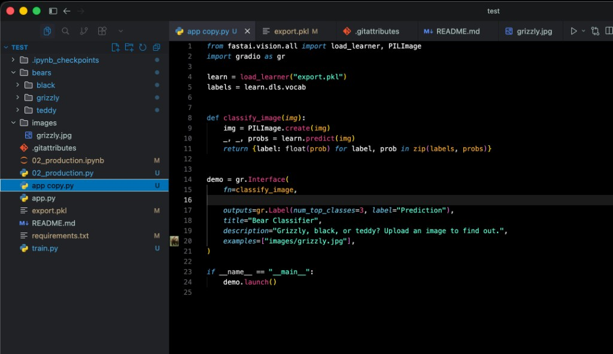

# Clearline

A dark VS Code theme designed for readability.

## Preview

  

  

## Installation

1. Open **Extensions** in VS Code or Cursor
2. Search for **Clearline**
3. Click **Install**
4. Open the Command Palette (`Cmd+Shift+P` on macOS, `Ctrl+Shift+P` on Windows/Linux)
5. Run **Preferences: Color Theme**
6. Select **Clearline-Dark**

## Credits

Based on [ChatGP-Theme](https://github.com/0xJariel/ChatGP-Theme) by [0xJariel](https://github.com/0xJariel).

Licensed under [CC BY-NC-SA 4.0](https://creativecommons.org/licenses/by-nc-sa/4.0/). This theme is modified from the original, renamed to **Clearline Dark**, and published by [tom0411](https://github.com/tom0411).

Made with Cursor Grok 4.5
